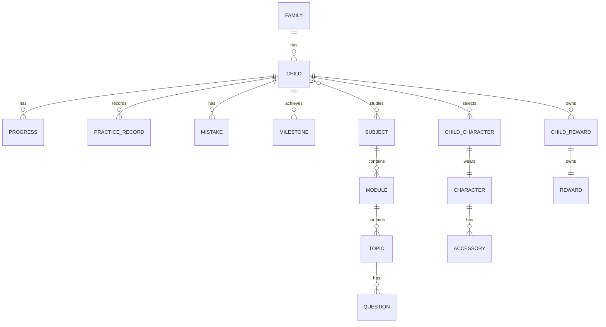
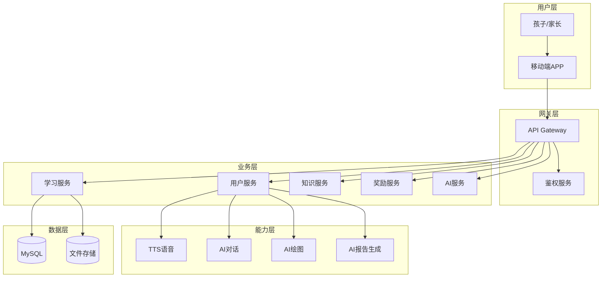
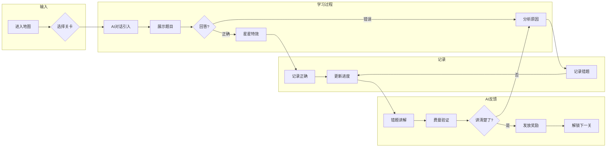
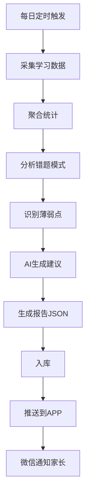

# AI学习伙伴 v2.0 整体架构文档

> 版本：v2.0  
> 日期：2026-05-24  
> 状态：框架设计阶段
>
> 一个陪伴孩子从幼小衔接到小学毕业的AI学习伙伴，通过游戏化方式让孩子在"学习大陆"上闯关学习各学科。

<!-- mermaid diagram theme -->
```mermaid
---
config:
  theme: base
  themeVariables:
    primaryColor: "#FF6B6B"
    primaryTextColor: "#fff"
    primaryBorderColor: "#FF6B6B"
    lineColor: "#666"
    secondaryColor: "#FFE66D"
    tertiaryColor: "#fff"
---
```

---

## 一、核心理念

**一句话描述**：一个陪伴孩子从幼小衔接到小学毕业的AI学习伙伴，通过游戏化方式让孩子在"学习大陆"上闯关学习各学科。

**核心愿景**：
- 不做"题库工具"，做"有情感的AI伙伴"
- 陪伴孩子6年成长，记录每一步足迹
- 模块化、可扩展的框架
- 专注小规模用户群体（10-100人），降低运维复杂度

---

## 二、产品架构

```
┌─────────────────────────────────────────────────────────────┐
│                      AI学习伙伴 APP                         │
├─────────────────────────────────────────────────────────────┤
│  ┌─────────────────────────────────────────────────────┐  │
│  │                    表现层 (UI Layer)                  │  │
│  │   🗺️ 地图视图  │  🎮 关卡选择  │  📺 动画剧场      │  │
│  │   👤 个人信息  │  📊 学习报告  │  🏆 成就展览      │  │
│  └─────────────────────────────────────────────────────┘  │
│                           ↑                                 │
│  ┌─────────────────────────────────────────────────────┐  │
│  │                 业务逻辑层 (Game Engine)              │  │
│  │   📋 关卡进度  │  🔓 解锁机制  │  🏆 成就系统      │  │
│  │   ⭐ 星星收集  │  📈 能力成长  │  🔔 复习提醒      │  │
│  └─────────────────────────────────────────────────────┘  │
│                           ↑                                 │
│  ┌─────────────────────────────────────────────────────┐  │
│  │                  知识内容层 (Modules)               │  │
│  │   🌱 萌芽森林  │  🧭 智慧山谷  │  🔮 星辰原野      │  │
│  │   🏰 几何城堡  │  🐉 挑战龙穴                        │  │
│  └─────────────────────────────────────────────────────┘  │
│                           ↑                                 │
│  ┌─────────────────────────────────────────────────────┐  │
│  │               💎 通用能力层 (Commons)                │  │
│  │   ┌────────┐  ┌────────┐  ┌────────┐  ┌────────┐  │  │
│  │   │ 🎤 TTS │  │ 🖼️ 绘图 │  │ 💬 对话 │  │ 📊 统计 │  │  │
│  │   │ 语音合成│  │ 图片生成│  │ AI对话 │  │ 学习数据│  │  │
│  │   └────────┘  └────────┘  └────────┘  └────────┘  │  │
│  │   ┌────────┐  ┌────────┐  ┌────────┐  ┌────────┐  │  │
│  │   │ 🎬 动画│  │ ⭐ 特效│  │ 📡 推送│  │ 🔐 安全 │  │  │
│  │   │ 骨骼动画│  │ 庆祝特效│  │ 通知推送│  │ 家长管控│  │  │
│  │   └────────┘  └────────┘  └────────┘  └────────┘  │  │
│  └─────────────────────────────────────────────────────┘  │
└─────────────────────────────────────────────────────────────┘
```

---

## 三、技术架构

```
┌─────────────────────────────────────────────────────────────────────────┐
│                           用户端 (Client)                                 │
├─────────────────────────────────────────────────────────────────────────┤
│                                                                         │
│   📱 Mobile App ( Flutter )                                            │
│   ┌───────────┐  ┌───────────┐  ┌───────────┐  ┌───────────┐          │
│   │ 🗺️ 地图   │  │ 🎮 关卡   │  │ 📺 动画   │  │ 👤 个人   │          │
│   │  地图选择 │  │   答题    │  │  动画播放 │  │   中心   │          │
│   └───────────┘  └───────────┘  └───────────┘  └───────────┘          │
│        ↓                ↓                ↓                ↓              │
│   ╔═══════════════════════════════════════════════╗                       │
│   ║              客户端 SDK (Client SDK)        ║                       │
│   ║  🎤 TTS │ 🎬 动画 │ 💬 对话 │ 📊 上报 │ ⭐ 特效 ║                       │
│   ╚═══════════════════════════════════════════════╝                       │
│                              │                                         │
│                              ↓ HTTP/WebSocket                          │
├─────────────────────────────────────────────────────────────────────────┤
│                                                                         │
│   ☁️ 云端服务 (Backend)                                                │
│                                                                         │
│   ┌─────────────────────────────────────────────────────────────┐     │
│   │                 API Gateway (REST + WebSocket)               │     │
│   │         统一入口 │ 鉴权 │ 限流 │ 路由 │ 日志                 │     │
│   └─────────────────────────────────────────────────────────────┘     │
│                              ↓                                         │
│   ┌──────────────┐  ┌──────────────┐  ┌──────────────┐  ┌──────────┐ │
│   │ 👤 用户服务  │  │ 🎮 游戏服务  │  │ 📚 知识服务  │  │💎 能力  │ │
│   │             │  │             │  │             │  │  服务   │ │
│   │ • 注册/登录  │  │ • 关卡/进度  │  │ • 题目/模块  │  │ • TTS   │ │
│   │ • 家长管控  │  │ • 解锁/成就  │  │ • AI生成    │  │ • 绘图   │ │
│   │ • 家庭账户  │  │ • 排行榜    │  │ • 题目推荐  │  │ • 对话   │ │
│   └──────────────┘  └──────────────┘  └──────────────┘  └──────────┘ │
│                                                                         │
│   ┌────────────────────────────────────────────────────────────────┐    │
│   │                 💎 通用能力平台 (Common Services)                 │    │
│   ├──────────┬──────────┬──────────┬──────────┬─────────┬─────────┤ │
│   │ 🎤 TTS  │ 🖼️ 绘图  │ 💬 对话  │ 📊 分析  │ 🔔 通知 │ 🐢 存储 │ │
│   │ 语音合成 │ Stable   │ 小水管   │ 学习分析 │ 推送   │ 文件存储│ │
│   │         │ Diffusion │ (AI)    │        │        │         │ │
│   └──────────┴──────────┴──────────┴──────────┴─────────┴─────────┘ │
│                                                                         │
├─────────────────────────────────────────────────────────────────────────┤
│                                                                         │
│   💾 数据层 (Data)                                                      │
│                                                                         │
│   ┌────────────┐  ┌────────────┐  ┌────────────┐                       │
│   │   MySQL   │  │   MinIO   │  │  文件存储 │                       │
│   │ 主数据库  │  │ 对象存储 │  │  本地存储 │                       │
│   └────────────┘  └────────────┘  └────────────┘                       │
│                                                                         │
└─────────────────────────────────────────────────────────────────────────┘
```

---

## 四、学科模块结构（可扩展）

> 设计原则：不是只有"数学大陆"，而是"学习大陆"，数学只是第一个学科

### 4.1 学科领地（通用结构）

```
┌─────────────────────────────────────────────────────────────┐
│                      学习大陆 🌎                            │
├─────────────────────────────────────────────────────────────┤
│                                                             │
│   ┌─────────────┐  ┌─────────────┐  ┌─────────────┐        │
│   │ 🔢 数学王国 │  │ 📖 语文书院 │  │ 🌐 英语世界 │  ...   │
│   │  (魔法岛)  │  │  (翰林院)   │  │  (星桥城)   │        │
│   └─────────────┘  └─────────────┘  └─────────────┘        │
│                                                             │
│   每个学科有独立的主题/玩法，但共用下面的通用系统           │
│   • 通用能力层（TTS/动画/对话等）共享                       │
│   • 学习记忆系统共享                                      │
│   • 进度/成就是独立计算的                                 │
└─────────────────────────────────────────────────────────────┘
```

### 4.2 各学科内容（当前规划）

| 学科 | 主题名称 | 年龄段 | 状态 |
|------|----------|--------|------|
| 🔢 **数学** | 数学大陆 | 幼小衔接到小学毕业 | 🔄 开发中 |
| 📖 **语文** | 翰林书院 | 幼小衔接到小学毕业 | ⬜ 规划中 |
| 🌐 **英语** | 星桥世界 | 幼小衔接到小学毕业 | ⬜ 规划中 |

### 4.3 如何新增学科

> 只需在数据库添加新学科记录，配置通用能力，即可自动接入

```json
// 新增学科示例：语文
{
  "subject_id": "chinese",
  "name": "语文书院",
  "theme": "翰林书院",
  "avatar": "📚",
  "color_theme": "#8B4513",
  "modules": [...],  // 汉语拼音/识字/阅读/写作...
  "common_capabilities": {
    "tts": true,
    "dialogue": true,
    " calligraphy ": true  // 书法特有
  }
}
```

### 4.4 五大领地（数学为例）

| 领地 | 守护力量 | 涵盖年级 | 状态 |
|------|----------|----------|------|
| 🌱 **萌芽森林** | 数感与计算 | 幼小衔接～1年级 | ✅ 现有版本 |
| 🧭 **智慧山谷** | 运算进阶 | 2～3年级 | ⬜ 规划中 |
| 🔮 **星辰原野** | 代数与方程 | 4～5年级 | ⬜ 规划中 |
| 🏰 **几何城堡** | 几何与测量 | 1～5年级 | ⬜ 规划中 |
| 🐉 **挑战龙穴** | AMC8/浅奥 | 3～5年级 | ⬜ 规划中 |

### 4.2 知识点清单

#### 萌芽森林（幼小衔接～1年级）
| 模块 | 知识点 | 状态 |
|------|--------|------|
| 数感启蒙 | 1-20数量认知、数的顺序、比大小 | ✅ |
| 分类与排序 | 按颜色/形状分类、简单规律 | ⬜ |
| 基本图形 | 圆形、三角形、正方形 | ⬜ |
| 5以内加减 | 5以内加减法 | ⬜ |
| 10以内加减 | 10以内加减法 | ⬜ |
| 凑十法 | 凑十法 | ⬜ |
| 破十法 | 破十法 | ⬜ |
| 认识钟表 | 整点、半点 | ⬜ |
| 认识人民币 | 元、角、分换算 | ⬜ |
| 找规律 | 图形规律、数列规律 | ⬜ |

#### 智慧山谷（2～3年级）
| 模块 | 知识点 |
|------|--------|
| 100以内加减 | 竖式计算、验算 |
| 表内乘除法 | 乘除法意义、口诀 |
| 长度单位 | 厘米和米 |
| 角的认识 | 直角、锐角、钝角 |
| 观察物体 | 不同方向观察形状 |
| 搭配问题 | 排列、组合初步 |
| 万以内加减 | 竖式计算 |
| 多位数乘一位数 | 竖式乘法 |
| 分数初步 | 分数意义、简单运算 |

#### 星辰原野（4～5年级）
| 模块 | 知识点 |
|------|--------|
| 大数认识 | 万、亿、读写法 |
| 三位数乘两位数 | 竖式乘法 |
| 垂直与平行 | 画垂线和平行线 |
| 三角�� | 分类、内角和 |
| 简易方程 | 3x+7=22 |
| 小数 | 小数意义、四则运算 |
| 分数 | 分数意义、通分、约分 |
| 因数与倍数 | 质数、合数、公因数、公倍数 |
| 立体几何 | 长方体、正方体表面积体积 |

#### 几何城堡（贯穿全阶段）
| 层级 | 内容 |
|------|------|
| L1 | 基本图形 |
| L2 | 角度 |
| L3 | 面积 |
| L4 | 立体几何 |

#### 挑战龙穴（AMC8竞赛）
| 模块 | 占比 |
|------|------|
| 代数 | 35-45% |
| 几何 | 20-30% |
| 数论 | 15-20% |
| 组合概率 | 15-20% |

---

## 六、学习记忆系统

### 5.1 三层记忆架构

```
┌────────────────────────────────────────────────────────────────┐
│                    孩子的学习记忆                            │
├────────────────────────────────────────────────────────────────┤
│                                                                │
│  ┌─────────────┐    ┌─────────────┐    ┌─────────────┐       │
│  │ 短期记忆   │    │ 中期记忆   │    │ 长期记忆   │       │
│  │ (当前周)   │    │ (本月)     │    │ (全周期)   │       │
│  ├─────────────┤    ├─────────────┤    ├─────────────┤       │
│  │ • 今日练习 │    │ • 周统计   │    │ • 年度总结 │       │
│  │ • 当前关卡 │    │ • 薄弱点   │    │ • 能力雷达 │       │
│  │ • 错题本   │    │ • 进度曲线 │    │ • 成长相册 │       │
│  └─────────────┘    └─────────────┘    └─────────────┘       │
│        ↓                  ↓                  ↓                 │
│  ═════════════════ 艾宾浩斯遗忘曲线复习提醒 ═══════════════    │
│                                                                │
└────────────────────────────────────────────────────────────────┘
```

### 5.2 错题记忆与薄弱点追踪

```json
// 错题记录
{
  "mistake_id": "mistake_xxx",
  "child_id": "child_001",
  "topic_id": "break10",
  "question": "15 - 7 = ?",
  "wrong_answer": "6",
  "correct_answer": "8",
  "times_wrong": 2,
  "first_wrong_date": "2026-05-20",
  "last_wrong_date": "2026-05-24",
  "spaced_review_enabled": true
}

// 薄弱点
{
  "weak_area": "破十法",
  "total_attempts": 10,
  "correct_times": 4,
  "accuracy": "40%",
  "suggestion": "建议回退到5以内减法重新巩固"
}
```

### 5.3 复习机制：艾宾浩斯 + 费曼结合

#### 艾宾浩斯遗忘曲线提醒
适合用来**对抗遗忘**，通过间隔重复让知识记得更牢：

| 阶段 | 时间节点 | 操作 |
|------|----------|------|
| Day 1 | 学习当天 | 新知识点学习 |
| Day 2 | 第一次复习 | 根据正确率决定下次间隔 |
| Day 4 | 第二次复习 | 如有遗忘，标记薄弱点 |
| Day 7 | 第三次复习 | 间隔递增 |
| Day 14 | 第四次复习 | 间隔递增 |
| Day 30 | 第五次复习 | 巩固后入长期记忆 |

#### 费曼学习法（讲解巩固法）
适合用来**真正理解**——不是刷题，是让孩子能讲清楚概念：

```
费曼四步曲：
1. 选择一个概念（如"凑十法"）
2. 让孩子试着给"嘟嘟"（AI伙伴）讲一遍
3. 讲不通的地方 → 回到题目重新理解
4. 用比喻/例子讲给小朋友能听懂 → 才是真的懂了

在应用中实现：
• 每道错题 → 不仅改正答案，还要让孩子用语音讲出为什么
• 薄弱知识点 → 触发"小老师"模式，给嘟嘟讲明白
• 讲对了 → 给予"小老师"奖章奖励
```

---

## 七、AI学习报告系统 (Smart Report)

> 定期生成孩子的学习画像，用AI给出个性化建议

### 7.1 报告类型

| 周期 | 发送给 | 内容 |
|------|--------|------|
| **每日报告** | 孩子 | 今日成就、趣味统计、最爱模块 |
| **周报** | 家长+孩子 | 本周进度、薄弱点汇总、建议 |
| **月报** | 家长+孩子 | 能力雷达图、进度曲线、横向对比 |
| **专题报告** | 家长 | 阶段性总结、升学建议、专家解读 |

### 7.2 报告内容结构

```json
{
  "report_id": "weekly_2026_05_w4",
  "child_id": "child_001",
  "period": "weekly",
  "date_range": "2026-05-18 ~ 2026-05-24",
  
  "summary": {
    "time_spent_minutes": 245,
    "topics_learned": 5,
    "questions_attempted": 120,
    "accuracy_rate": "78%",
    "stars_earned": 23,
    "streak_days": 7
  },
  
  "strengths": [
    {"topic": "凑十法", "accuracy": "95%", "level": "excellent"},
    {"topic": "20以内加减", "accuracy": "88%", "level": "good"}
  ],
  
  "weak_areas": [
    {
      "topic": "破十法",
      "accuracy": "45%",
      "root_cause": "退位概念不理解",
      "suggestion": "建议先用5以内减法建立信心"
    }
  ],
  
  "ai_recommendations": [
    {
      "priority": "high",
      "title": "本周重点：突破破十法",
      "reason": "连续3周正确率低于50%",
      "action": "• 先回顾5以内减法\n• 每天练习3道破十法\n• 尝试用实物道具辅助理解",
      "estimated_days": 7
    }
  ]
}
```

### 7.3 AI画像（小巫师档案）

```
┌─────────────────────────────────────────────────┐
│           🧙 小巫师档案                        │
├─────────────────────────────────────────────────┤
│  名字：囡囡                    │
│  年龄：6岁                      │
│  魔法等级：Lv.3 学徒           │
│  🎯 本周成就：连续7天学习，获得23颗星星  │
│                                           │
│  📊 能力雷达                      │
│  • 数感    ████████░░ 82%         │
│  • 计算    ██████░░░░░ 65%         │
│  • 几何    ████░░░░░░ 45%         │
│  • 逻辑    █████░░░░░░ 55%         │
│                                           │
│  ⚡ 待加强：                     │
│  • 破十法（正确率45%）←本周重点！ │
│                                           │
│  💡 AI小导师建议：                │
│  "破十法有点难，但不要急！"     │
│  "先试试5-3=2，再想想15-7怎么算"    │
└─────────────────────────────────────────────────┘
```

### 7.4 报告推送机制

```
每日 18:00 ──▶ 自动采集学习数据
       │
       ▼
  聚合统计 → 错题分析 → AI生成建议
       │
       ▼
  生成报告 → 入库 → 推送(APP/微信)
```

---

## 八、角色与装饰系统 (Character & Rewards)

> 让孩子打造属于自己的专属伙伴，增加粘性与成就感

### 8.1 奖励货币体系

| 货币 | 获取方式 | 用途 |
|------|----------|------|
| ⭐ **星星** | 答题正确、连续学习、里程碑 | 解锁地图、买装饰 |
| 💎 **钻石** | 充值/成就奖励 | 稀有装饰、特殊功能 |
| 🎯 **积分** | 日常任务 | 换取每日奖励 |

### 8.2 装饰系统

```
┌─────────────────────────────────────────────────────┐
│              嘟嘟的魔法衣橱                       │
├─────────────────────────────────────────────────────┤
│                                             │
│  🎩 头饰     皇冠 ✨ / 巫师帽 ✨ / 花环       │
│  👓 眼镜     墨镜 / 近视镜 / 星星镜         │
│  🧣 围巾     红色 ✨ / 蓝色 / 彩虹 ✨      │
│  🎀 蝴蝶结   粉色 ✨ / 紫色 / 金色 ✨     │
│  🪄 法杖     星星棒 ✨ / 魔法棒 ✨        │
│  🦄 坐骑     独角兽 ∕ 飞马 ∕ 龙         │
│                                             │
│  ✨ = 可通过AI自动生成                           │
└─────────────────────────────────────────────────────┘
```

### 8.3 装饰获取机制

```
点亮知识点 → 获得星星 → 换取装饰 → 装扮嘟嘟
                                           │
          ┌─────────────────────────────────┘
          ▼
    成就解法：
    • 首次完成凑十法 → 🎀 蝴蝶结(粉色)
    • 连续7天学习 → 🪄 星星法杖
    • 获得100颗星星 → 🏆 闪耀徽章
    • 通关萌芽森林 → 🦄 独角兽坐骑
```

### 8.4 AI自动生成装饰（未来功能）

```json
// AI生成装饰配置
{
  "feature": "ai_costume",
  "status": "planning",
  "implementation": "Flux/SD可控制生成",
  "prompt_template": "一个可爱的粉色{accessory}戴在仓鼠小动物头上，卡通风格，透明背景",
  "variations": [
    "{crown|hat|bow|crown|glasses}",
    "{pink|blue|purple|gold|rainbow}"
  ],
  "cost": {
    "stars": 50,
    " diamonds": 10
  }
}
```

---

## 九、角色资源库 (Character Library)

> 不同孩子可能喜欢不同风格，准备多个角色主题

### 9.1 角色主题池

| 风格 | 角色名 | 适合 | 状态 |
|------|--------|------|------|
| 🐹 萌系 | 嘟嘟 | 喜欢可爱小动物的女孩 | ✅ 建设中 |
| 🦸 英雄 | 奥盟战士 | 喜欢奥特战士的男孩 | ⬜ 规划中 |
| 🐲 恐龙 | 恐龙博士 | 喜欢恐龙的孩小男孩 | ⬜ 规划中 |
| 🧙 魔幻 | 小法师 | 喜欢哈利波特的孩子 | ⬜ 规划中 |

### 9.2 角色属性（通用）

```json
{
  "character_id": "dudu",
  "name": "嘟嘟",
  "type": "cute_animal",
  "species": "hamster_rabbit_hybrid",
  "personality": "好奇、勇敢、偶尔迷糊",
  "voice_id": "Chinese_Cute_Spirit",
  "animations": ["jump", "happy", "think", "celebrate", "sad"],
  
  "base_colors": {
    "body": "#FFB6C1",
    "belly": "#FFF5EE",
    "eyes": "#333333"
  },
  
  "accessories": {
    "head": ["crown", "flower", "hat"],
    "neck": ["scarf", "bow"],
    "hand": ["wand", "star"]
  }
}
```

### 9.3 选择流程

```
注册/建档 → 选择角色主题 → 选择具体角色 → 个性化装饰
     │            │              │             │
     ▼            ▼              ▼             ▼
  引导页    "你喜欢什么风格？"  "喜欢哪个角色？" "给他取名字"
```

---

## 十、数据模型

### 6.1 核心实体关系（Mermaid图）



---

### 6.2 系统数据流图



---

### 6.3 学习流程图



---

### 6.4 报告生成流程图



### 6.2 数据库表设计

#### family (家庭表)
```sql
CREATE TABLE family (
  family_id VARCHAR(32) PRIMARY KEY,
  parent_id VARCHAR(32) NOT NULL,
  phone VARCHAR(20),
  created_at TIMESTAMP DEFAULT NOW()
);
```

#### child (孩子表)
```sql
CREATE TABLE child (
  child_id VARCHAR(32) PRIMARY KEY,
  family_id VARCHAR(32) REFERENCES family(family_id),
  name VARCHAR(50),
  avatar VARCHAR(20),
  birth_date DATE,
  start_date DATE,
  expected_graduation DATE,
  total_stars INT DEFAULT 0,
  level INT DEFAULT 1,
  created_at TIMESTAMP DEFAULT NOW()
);
```

#### subject (学科表)
```sql
CREATE TABLE subject (
  subject_id VARCHAR(32) PRIMARY KEY,
  name VARCHAR(50),
  theme_name VARCHAR(50),  -- 主题名如"魔法岛""翰林院""
  icon VARCHAR(10),
  color_theme VARCHAR(10),
  status VARCHAR(20) DEFAULT 'planned',
  order_index INT,
  created_at TIMESTAMP DEFAULT NOW()
);

INSERT INTO subject VALUES 
('math', '数学', '数学大陆', '🔢', '#FF6B6B', 'active', 1),
('chinese', '语文', '翰林书院', '📖', '#8B4513', 'planned', 2),
('english', '英语', '星桥世界', '🌐', '#4169E1', 'planned', 3);
```

#### module (知识模块表)
```sql
CREATE TABLE module (
  module_id VARCHAR(32) PRIMARY KEY,
  subject_id VARCHAR(32) REFERENCES subject(subject_id),  -- 关联学科
  name VARCHAR(50),
  description TEXT,
  grade_range VARCHAR(50),
  status VARCHAR(20) DEFAULT 'planned',  -- planned/active/completed
  unlock_require VARCHAR(32),  -- 前置模块ID
  order_index INT,
  created_at TIMESTAMP DEFAULT NOW()
);
```

#### topic (知识点表)
```sql
CREATE TABLE topic (
  topic_id VARCHAR(32) PRIMARY KEY,
  module_id VARCHAR(32) REFERENCES module(module_id),
  name VARCHAR(50),
  description TEXT,
  difficulty INT DEFAULT 1,  -- 1-5
  estimated_minutes INT DEFAULT 10,
  status VARCHAR(20) DEFAULT 'planned',
  ai_prompt TEXT,
  created_at TIMESTAMP DEFAULT NOW()
);
```

#### question (题目表)
```sql
CREATE TABLE question (
  question_id VARCHAR(32) PRIMARY KEY,
  topic_id VARCHAR(32) REFERENCES topic(topic_id),
  content TEXT,
  options JSONB,
  answer VARCHAR(10),
  explanation TEXT,
  difficulty INT DEFAULT 1,
  created_at TIMESTAMP DEFAULT NOW()
);
```

#### progress (学习进度表)
```sql
CREATE TABLE progress (
  progress_id VARCHAR(32) PRIMARY KEY,
  child_id VARCHAR(32) REFERENCES child(child_id),
  topic_id VARCHAR(32) REFERENCES topic(topic_id),
  status VARCHAR(20) DEFAULT 'locked',  -- locked/active/completed
  stars INT DEFAULT 0,
  completed_at TIMESTAMP,
  created_at TIMESTAMP DEFAULT NOW(),
  UNIQUE(child_id, topic_id)
);
```

#### practice_record (练习记录表)
```sql
CREATE TABLE practice_record (
  record_id VARCHAR(32) PRIMARY KEY,
  child_id VARCHAR(32) REFERENCES child(child_id),
  topic_id VARCHAR(32) REFERENCES topic(topic_id),
  question_id VARCHAR(32) REFERENCES question(question_id),
  result VARCHAR(10),  -- correct/wrong
  wrong_answer VARCHAR(100),
  time_spent_seconds INT,
  created_at TIMESTAMP DEFAULT NOW()
);
```

#### mistake (错题本表)
```sql
CREATE TABLE mistake (
  mistake_id VARCHAR(32) PRIMARY KEY,
  child_id VARCHAR(32) REFERENCES child(child_id),
  topic_id VARCHAR(32) REFERENCES topic(topic_id),
  question_id VARCHAR(32) REFERENCES question(question_id),
  times_wrong INT DEFAULT 1,
  first_wrong_date DATE,
  last_wrong_date DATE,
  spaced_review_enabled BOOLEAN DEFAULT TRUE,
  next_review_date DATE,
  created_at TIMESTAMP DEFAULT NOW()
);
```

#### milestone (里程碑表)
```sql
CREATE TABLE milestone (
  milestone_id VARCHAR(32) PRIMARY KEY,
  child_id VARCHAR(32) REFERENCES child(child_id),
  event VARCHAR(100),
  description TEXT,
  achieved_at TIMESTAMP DEFAULT NOW()
);
```

#### 奖励/装饰相关表
```sql
CREATE TABLE reward (
  reward_id VARCHAR(32) PRIMARY KEY,
  name VARCHAR(50),
  type VARCHAR(20),
  cost_stars INT,
  cost_diamonds INT
);

CREATE TABLE child_reward (
  id VARCHAR(32) PRIMARY KEY,
  child_id VARCHAR(32) REFERENCES child(child_id),
  reward_id VARCHAR(32) REFERENCES reward(reward_id)
);

CREATE TABLE character (
  character_id VARCHAR(32) PRIMARY KEY,
  name VARCHAR(50),
  theme VARCHAR(50),
  voice_id VARCHAR(50),
  personality TEXT
);

CREATE TABLE child_character (
  id VARCHAR(32) PRIMARY KEY,
  child_id VARCHAR(32) REFERENCES child(child_id),
  character_id VARCHAR(32) REFERENCES character(character_id),
  equipped_accessories JSONB DEFAULT '{}'
);

CREATE TABLE accessory (
  accessory_id VARCHAR(32) PRIMARY KEY,
  name VARCHAR(50),
  slot VARCHAR(20),
  cost_stars INT,
  rarity VARCHAR(20)
);
```

---

## 七、技术栈选型

| 层级 | 技术 | 说明 |
|------|------|------|
| **前端** | Flutter / HTML5 Canvas | 跨平台(iOS/Android)，或浏览器直接访问 |
| **后端** | Python FastAPI | 简单高效，易于维护，小规模用户足够 |
| **AI对话** | MiniMax API / 通义千问 | 中国队友好，成本低 |
| **TTS** | MiniMax TTS | 支持儿童音色 |
| **图片生成** | 通义万相 / Flux | 可控生成 |
| **主数据库** | MySQL | 关系型数据，满足需求 |
| **文件存储** | 本地存储 / 云存储 | 小规模用户用本地或OSS即可 |
| **缓存** | 不需要 | 10-100用户规模，数据库直接扛得住 |

---

## 八、通用能力层调用示例

每个知识模块都可以调用通用能力：

```json
// 模块配置示例
{
  "module_id": "sprout_forest_carry10",
  "name": "凑十法",
  "capabilities": {
    "tts": {
      "voice": "Chinese_Cute_Spirit",
      "intro": "小朋友，凑十法就像变小魔术一样，超厉害的呢！"
    },
    "animation": ["carry10_magic", "number_bubble"],
    "effects": {
      "correct": "star_rain",
      "wrong": "try_again"
    }
  }
}
```

---

## 九、发展路线图

### Phase 1: MVP（当前版本）
- [x] 简单的数学题目功能
- [x] 基础TTS语音
- [ ] 地图展示

### Phase 2: 框架搭建
- [ ] 完整的5领地地图框架
- [ ] 模块化知识体系
- [ ] 通用能力层抽象
- [ ] 的学习记忆系统

### Phase 3: 完善内容
- [ ] 萌芽森林所有知识点
- [ ] 智慧山谷内容
- [ ] 星辰原野内容

### Phase 4: 扩展功能
- [ ] 几何城堡
- [ ] 挑战龙穴(AMC8)
- [ ] 多孩子支持
- [ ] 家长端

---

## 十、待讨论事项

1. 技术栈最终选型（Go vs Node.js）
2. 首期开发人力评估
3. 是否需要AI辅助生成题目
4. 家长端功能范围
5. 合规与数据安全要求

---

*本文档为框架设计，将根据讨论持续更新*